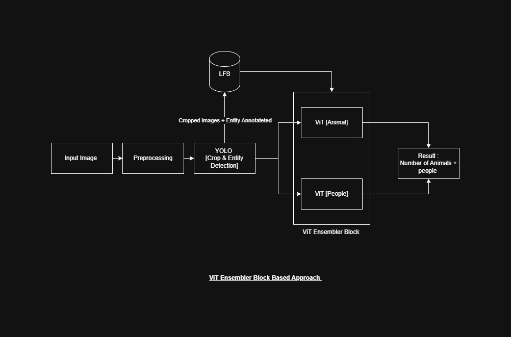
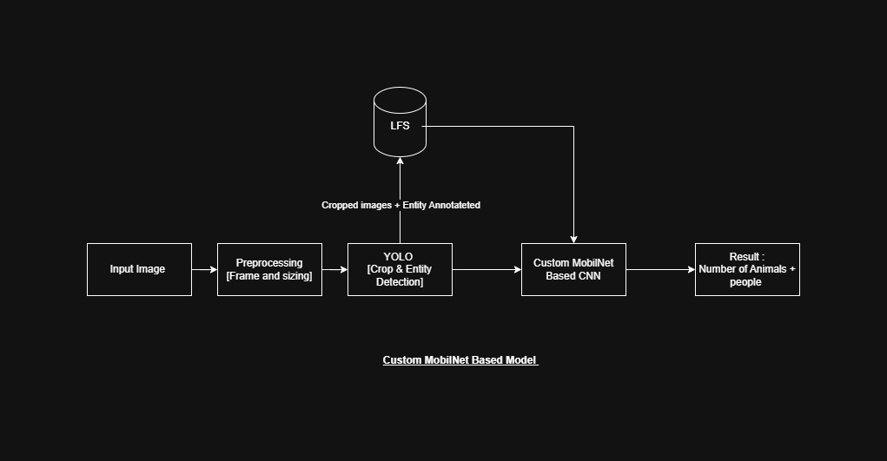
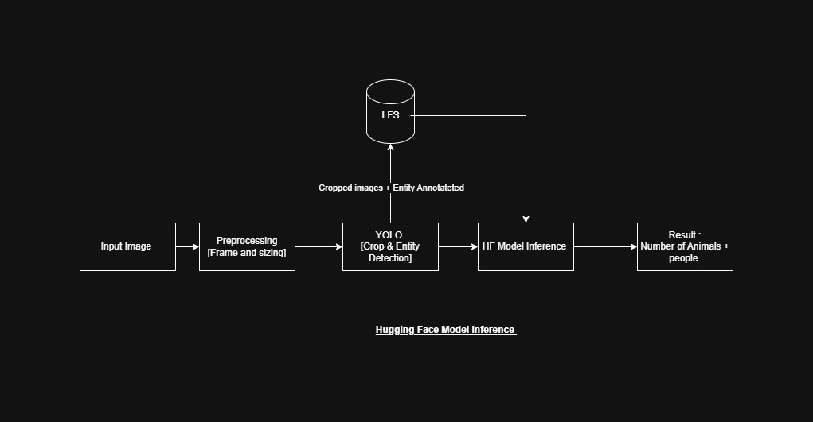
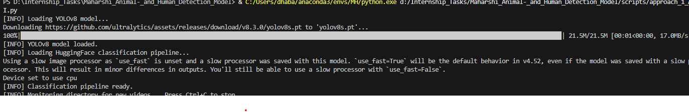
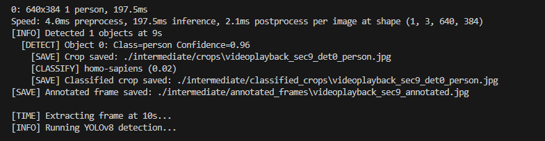
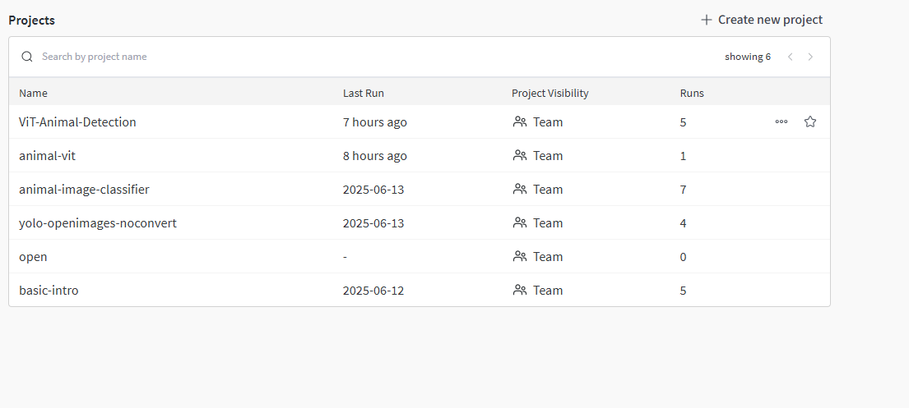
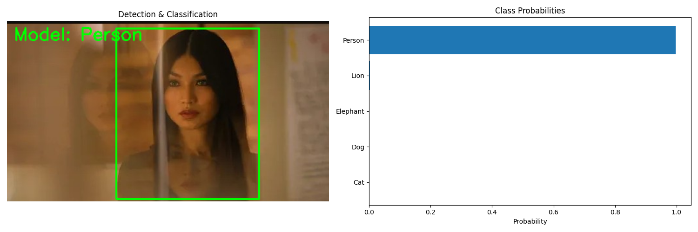
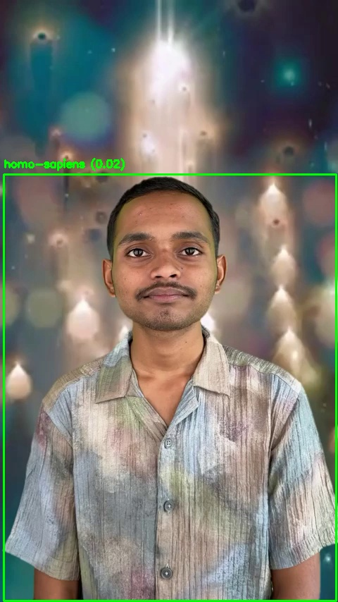

# Animal and Person Detection Pipeline

This repository presents multiple approaches for detecting animals and people in video footage. Our pipeline combines **YOLOv8** object detection with various classification strategies to label detected entities as either *Person* or *Animal*.

I explored three distinct classification strategies:

1. **YOLO + ViT (Vision Transformer)** — baseline trial approach
2. **YOLO + MobileNet on Custom Dataset** — optimized local model  
3. **YOLO + HuggingFace API** — offloaded classification via API
---

##  Dataset

I sourced annotated data from open repositories and manually curated a custom dataset by cropping YOLO-detected bounding boxes of entities.

- I validated dataset quality through visual sampling, class balance, and noise checks.
- Image samples Ire filtered for clarity, centered content, and consistent class distribution.
- Image Datasets were also selected based on amount of data in them and the suggested splits as well 
- here are the links 
- https://www.kaggle.com/datasets/shiv28/animal-5-mammal
- https://huggingface.co/Dalmatiner/cv_animals
- https://huggingface.co/dima806/animal_151_types_image_detection/tree/main

---

## Model Approaches

### 1. **YOLO + ViT**
- I used a pre-trained ViT for classifying objects from YOLO detections.
- **Results**: High computational cost, overfitting issues, poor generalization and also very bas approach overall.
- I thought he ensembler would work in parallel but a very mixed result is found in the end with conflicting endings 



### 2. **YOLO + MobileNet (Custom Dataset)**
- MobileNet was fine-tuned on our curated dataset.
- LightIight, fast, and significantly more accurate.



### 3. **YOLO + HuggingFace API**
- Used [dima806/animal_151_types_image_detection](https://huggingface.co/dima806/animal_151_types_image_detection/tree/main).
- Achieved fast prototyping, no training, and good generalization on rare animal classes.



  


---
## HOW TO RUN 
### Usage

#### HuggingFace API Approach

```bash
cd ./scripts
python Approach_1_API.py
```
#### Classifier approach ViT

```bash
cd ./animal_person_classifier
python test_model.py --image NT.jpg
```
#### MobilNeT Custom CNN approach

```bash
cd ./scripts
python Approach_2_Model.py --video videoplayback.mp4
```
## Training Process

- Used `wandb` for logging training metrics, learning rate, and augmentation tracking.
- Enabled early stopping and hyperparameter tuning via sIeps.



---

## Pipeline Architecture

Our unified pipeline includes the following stages:
1. YOLOv8 detection on frames
2. Crop and preprocess entities
3. Classify using chosen backend (ViT / MobileNet / API)
4. Annotate frames and save predictions



---

## Testing and Results

Below is an example output with YOLO+MobileNet:

  


---

## Conclusion

Among the three methods:
- **YOLO + MobileNet** offered the best balance betIen accuracy and inference speed. -- best results from custom training 
- **ViT** was computationally expensive with loIr ROI. -- worst result and incomplete answers 
- **HuggingFace API** provided rapid prototyping and high flexibility. -- great classification and general outputs 

---

##  Future Work
- Expand the dataset to more animal classes
- Test neIr transformer-based lightIight classifiers
- Integrate real-time Ibcam streaming support
- better use of enseble blocks 

---