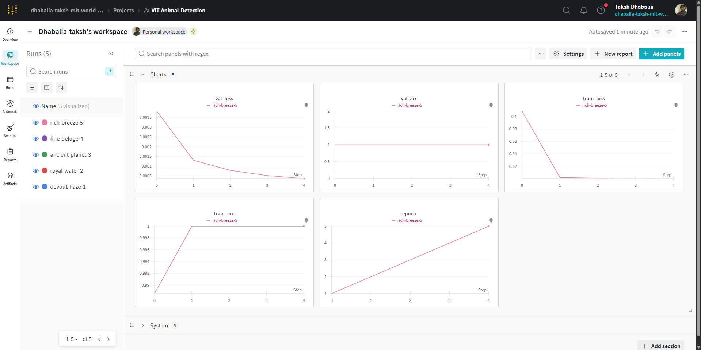

# 🧠 Animal and Person Detection Pipeline

This repository presents multiple approaches for detecting animals and people in video footage. Our pipeline combines **YOLOv8** object detection with various classification strategies to label detected entities as either *Person* or *Animal*.

We explored three distinct classification strategies:

1. **YOLO + ViT (Vision Transformer)** — baseline trial  
2. **YOLO + MobileNet on Custom Dataset** — optimized local model  
3. **YOLO + HuggingFace API** — offloaded classification via API

---

## 📂 Dataset

We sourced annotated data from open repositories and manually curated a custom dataset by cropping YOLO-detected bounding boxes of entities.

- We validated dataset quality through visual sampling, class balance, and noise checks.
- Image samples were filtered for clarity, centered content, and consistent class distribution.

---

## 📊 Model Approaches

### 1. **YOLO + ViT**
- We used a pre-trained ViT for classifying crops from YOLO detections.
- **Results**: High computational cost, overfitting issues, poor generalization.

### 2. **YOLO + MobileNet (Custom Dataset)**
- MobileNet was fine-tuned on our curated dataset.
- Lightweight, fast, and significantly more accurate.

### 3. **YOLO + HuggingFace API**
- Used [dima806/animal_151_types_image_detection](https://huggingface.co/dima806/animal_151_types_image_detection/tree/main).
- Achieved fast prototyping, no training, and good generalization on rare animal classes.

  

---

## ⚖️ Training Process

- Used `wandb` for logging training metrics, learning rate, and augmentation tracking.
- Enabled early stopping and hyperparameter tuning via sweeps.

---

## 📀 Pipeline Architecture

Our unified pipeline includes the following stages:
1. YOLOv8 detection on frames
2. Crop and preprocess entities
3. Classify using chosen backend (ViT / MobileNet / API)
4. Annotate frames and save predictions

---

## 📊 Testing and Results

Below is an example output with YOLO+MobileNet:

  

Also sample intermediate frames:

  

---

## ✅ Conclusion

Among the three methods:
- **YOLO + MobileNet** offered the best balance between accuracy and inference speed.
- **ViT** was computationally expensive with lower ROI.
- **HuggingFace API** provided rapid prototyping and high flexibility.

---

## 💡 Future Work
- Expand the dataset to more animal classes
- Test newer transformer-based lightweight classifiers
- Integrate real-time webcam streaming support

---